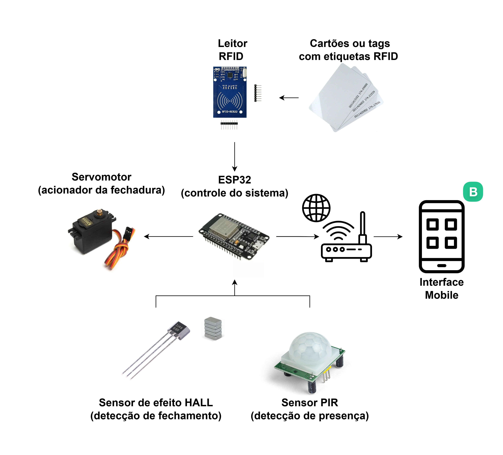

# PoliLock - ESP32 Access Control System
Embedded system project using ESP32, PIR, Hall sensor, RFID (MFRC522), and Servo motor with Blynk integration.
This project was developed in 2025 as part of the Embedded Systems Laboratory course in the Computer Engineering program at the Polytechnic School, University of São Paulo (Poli-USP).

## Overview
This firmware implements an access control system:
- **Sensors**: PIR (motion), Hall sensor (magnetic presence), RFID MFRC522 (card UID)
- **Actuator**: Servo motor (PWM angle control)
- **Connectivity**: Wi-Fi + Blynk (Virtual Pins over MQTT)
- **Architecture**: Hardware drivers → Services → Application (FSM) → User interface

## System Architecture



## Software Architecture


## Hardware


## Blynk (Virtual Pins)
- **V0**: Slider → Servo angle (0–180°)  
- **V1**: Value/LED → PIR state (0/1)  
- **V2**: Value/LED → Hall state (0/1)  
- **V3**: Label/Terminal → Telemetry (RSSI, heap, uptime, angle)  
- **V4**: Label → Last RFID UID  
- **V5**: Switch → Manual/Auto mode  

## Getting started
1. Clone this repo and open in **VS Code + PlatformIO**.
2. Copy `include/secrets.h.template` → `include/secrets.h` and fill in:
   - Wi-Fi SSID and password  
   - Blynk Auth Token  
3. Adjust pin definitions in `include/config.h`.
4. Build & upload:
   ```bash
   pio run
   pio run -t upload
   pio device monitor -b 115200
